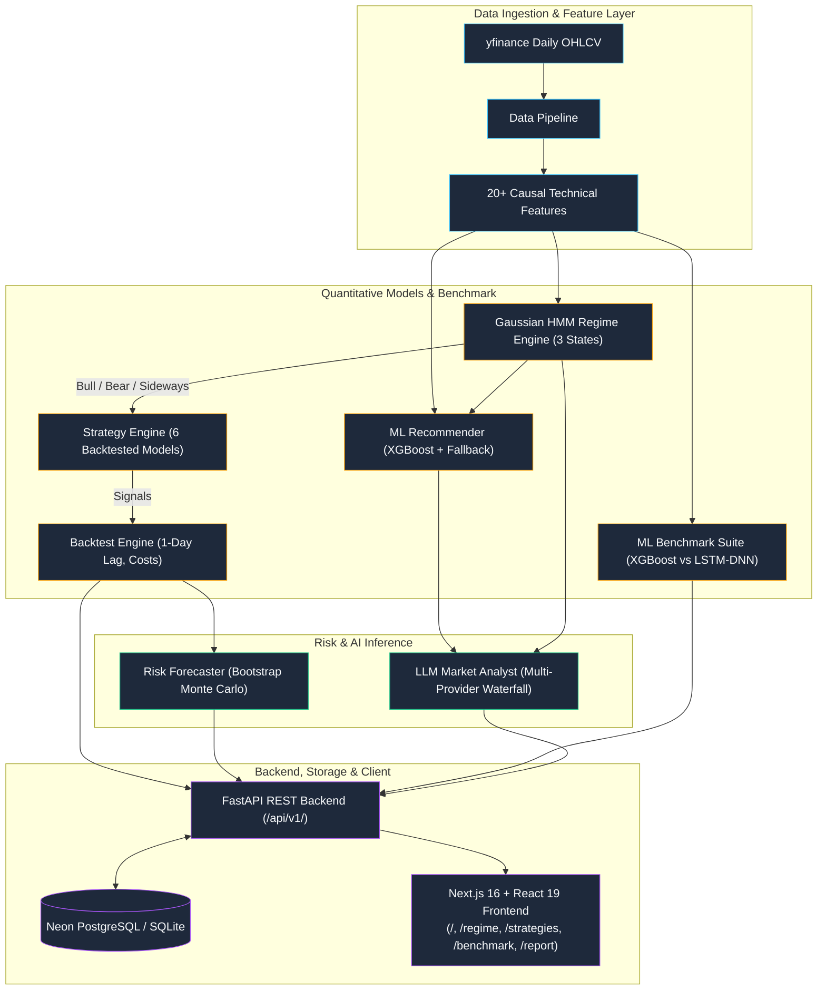

# Indian Market Portfolio Intelligence

## System Philosophy, Architecture, and Design Decisions

---

# 1. What This Project Actually Is

**Indian Market Portfolio Intelligence** is not a generic stock prediction app.

It is a **regime-aware quantitative trading intelligence platform** for Indian equity markets that combines:

- Statistical regime detection via Gaussian Hidden Markov Models
- Validation-gated ML-assisted strategy recommendation via XGBoost, with legacy Random Forest compatibility
- Deep learning benchmarking via LSTM-DNN (PyTorch)
- Probabilistic risk simulation via bootstrap Monte Carlo
- Institutional-grade AI market commentary via a multi-provider LLM analyst
- A demo-ready REST API and a modern React frontend

The core idea:

> Instead of predicting exact stock prices, identify the current market regime and determine which trading strategy has the highest probability of succeeding under current market conditions.

---

# 2. What The Project Is NOT

- Not a guaranteed profit machine
- Not a magical stock predictor
- Not a high-frequency trading system
- Not a brokerage replacement
- Not a wealth management platform

The system does not attempt deterministic prediction. It provides:

- Probabilistic short-term market outlooks
- Regime-aware strategy recommendations
- Quantified risk understanding under the current regime
- Institutional-quality AI narrative commentary

The correct positioning:

> "ML-assisted probabilistic market intelligence under varying market regimes."

---

# 3. Core Objective

> Build a regime-aware machine learning platform that evaluates Indian equity market conditions and provides probabilistic short-term trading insights, strategy recommendations, and risk-aware analytics for both beginner and professional traders.

---

# 4. Target Users

## Beginner Mode

Retail participants with little quantitative finance knowledge. The dashboard presents:

| Output | Example |
|---|---|
| Market Outlook | Moderately Bullish |
| Confidence | 64% |
| Current Regime | Bull Market |
| Suggested Style | Momentum-based |
| Drawdown Risk | Medium |
| AI Commentary | Narrative market report |

The beginner interface abstracts all quantitative complexity. The system acts as:
> "Decision abstraction through machine learning."

## Professional Mode

Advanced traders, quants, finance students, and strategy researchers get:

- Strategy equity curves (all 6 strategies on one chart)
- OHLCV candlestick overlay
- Regime heatmap (strategy × regime Sharpe matrix)
- Regime timeline segments
- XGBoost vs LSTM-DNN benchmark comparison
- Risk forecast bands (10th / 50th / 90th percentile drawdowns)
- Full ML probability distribution across strategies
- Pinnable AI analyst report with provider selection

---

# 5. System Architecture



---

# 6. Component Breakdown

## Data Pipeline (`src/data_pipeline.py`)

Fetches canonical NIFTY 50 OHLCV data via yfinance and engineers pipeline features. The recommender derives additional causal features from each 252-day decision window:

- RSI (14-day)
- MACD and signal line
- ADX (trend strength)
- Bollinger Band width
- Rolling 5/20/60-day returns
- Rolling 20/60-day volatility
- 12-month and 6-month momentum
- Volume is retained for display and data quality checks, but zero-volume history is not trusted as a recommender feature.

---

## Regime Engine — Gaussian HMM (`src/regime_detector.py`)

**Architecture upgrade over v1's KMeans:**

| Property | KMeans (v1) | Gaussian HMM (v2) |
|---|---|---|
| Model type | Unsupervised clustering | Probabilistic generative model |
| State dependencies | None (i.i.d.) | Markov transition matrix |
| Output | Hard cluster assignment | Soft state probabilities |
| Temporal continuity | None | Built-in via transition dynamics |
| Interpretability | Centroid distances | Emission parameters + transition matrix |

The HMM models market states as a latent 3-state Markov chain with Gaussian emissions over (returns, volatility). This captures regime persistence — Bull markets don't flip to Bear overnight.

---

## Strategy Engine (`src/strategies.py`)

| Strategy | Logic | Best Regime |
|---|---|---|
| Buy & Hold | Always long (benchmark) | Bull |
| MA Crossover | 50 SMA > 200 SMA | Trending |
| RSI | Buy <30, sell >70 | Sideways |
| Momentum | Long when 12m return > 0 | Bull |
| Bollinger Bands | Mean-reversion on band touches | Sideways |
| Dual Momentum | Positive absolute + relative momentum | Strong trends |

---

## Backtest Engine (`src/backtester.py`)

Realistic execution modeling:

- **Commission**: configurable percentage (default 0 for MVP, adjustable via API)
- **Slippage**: bid-ask spread simulation
- **Signal lag**: T+1 execution (no look-ahead bias)
- **Metrics**: CAGR, Sharpe, Sortino, Max Drawdown, Calmar, Volatility

---

## ML Benchmark (`src/models/`)

### XGBoost (`src/models/recommender.py`)
- Gradient-boosted trees on lagged returns + regime features
- Walk-forward validation with explicit promotion gate; current production recommendation state is historical fallback.
- Candidate scores remain behind promotion gate; current production recommendation state is historical fallback.

### LSTM-DNN (`src/models/lstm_benchmark.py`)
- PyTorch sequence model (2 LSTM layers + 2 FC layers)
- Trained on rolling 60-day windows
- Benchmarked against XGBoost on identical train/test splits

The `/api/v1/benchmark` endpoint exposes a canonical-dataset head-to-head academic comparison and persists benchmark records. It does not approve production ML recommendations.

---

## ML Classifier (`src/classifier_training.py`)

Legacy Random Forest compatibility path:

- **Target**: which strategy outperforms Buy & Hold over the next 63 trading days
- **Features**: lagged returns, rolling volatility, RSI, regime state embedding, momentum
- **Output**: probability distribution over all 6 strategies
- **Fallback**: if ML confidence < threshold, falls back to historical Sharpe ranking

---

## Risk Forecaster (`src/risk_forecaster.py`)

Regime-conditioned bootstrap Monte Carlo:

- Resamples daily returns within the current regime
- Runs 1,000 forward simulation paths
- Reports 10th / 50th / 90th percentile drawdown and exposure recommendations

---

## LLM Analyst (`src/llm/`)

### Provider Waterfall
```
GEMINI_API_KEY    → Gemini 2.0 Flash
GROQ_API_KEY      → Llama 3.3 70B Versatile
NVIDIA_NIM_API_KEY → meta/llama-3.3-70b-instruct (NVIDIA NIM)
OPENROUTER_API_KEY → auto-selected
(none required)   → Deterministic offline Mock
```

The waterfall cascades automatically on quota/timeout errors. Each provider uses the same structured 5-section institutional prompt:

1. Executive Market & Regime Diagnosis
2. Strategy Performance Review
3. Risk Assessment
4. Forward Outlook
5. Trading Intelligence Summary

### Pinning a Provider
The `POST /api/v1/llm-report?provider=nvidia` query param lets callers pin a specific provider without changing any configuration. Model suffixes are also supported: `?provider=nvidia:meta/llama-3.3-70b-instruct`.

---

## Persistence Layer (`src/db/`)

SQLAlchemy 2.0 ORM backed by Neon PostgreSQL (with automatic SQLite fallback and startup table initialization):

| Table | Contents |
|---|---|
| `backtest_logs` | Per-run strategy metrics + ticker + date range |
| `regime_history` | HMM regime snapshots and timeline context |
| `model_benchmarks` | XGBoost vs LSTM comparison results |

---

## FastAPI Backend (`src/api/`)

All endpoints are mounted under `/api/v1/` with OpenAPI documentation at `/docs`:

```
GET  /health
GET  /api/v1/regime?ticker=^NSEI
GET  /api/v1/recommend?ticker=^NSEI
POST /api/v1/backtest
POST /api/v1/analyze
GET  /api/v1/benchmark
POST /api/v1/llm-report?provider=<optional>
```

CORS is open for all origins (development). For production, restrict `allow_origins` to your frontend domain.

---

## Next.js Frontend (`frontend/`)

| Page | Description |
|---|---|
| `/` | Unified Beginner / Pro dashboard with mode toggle |
| `/regime` | Interactive HMM regime timeline and distribution |
| `/benchmark` | XGBoost vs LSTM-DNN metrics side-by-side |
| `/report` | AI Analyst report with provider dropdown (Gemini / Groq / NVIDIA / OpenRouter) |

All pages are React Server Components with `"use client"` boundaries only where hooks are needed. API clients live in `frontend/src/lib/`.

---

# 7. Why Gaussian HMM Instead of KMeans

| Criterion | KMeans | Gaussian HMM |
|---|---|---|
| Captures temporal dependencies | ✗ | ✓ |
| Models regime persistence | ✗ | ✓ |
| Provides state probabilities | ✗ | ✓ |
| Handles non-spherical clusters | ✗ | ✓ |
| Regime transition modeling | ✗ | ✓ |
| Interpretable parameters | Centroids | Means, covariances, transition matrix |

Real markets exhibit persistence — a Bull regime tends to remain Bull for many consecutive days. HMM's Markov structure captures this directly.

---

# 8. Why Random Forest Instead of Deep Learning

The modern recommendation path uses XGBoost. Legacy Random Forest artifacts remain supported while models are regenerated from the canonical dataset. LSTM remains a *comparison benchmark*, not the primary system.

### Financial time series are inherently noisy

- Low signal-to-noise ratio
- Regime shifts violate stationarity assumptions
- Deep models trained on one regime can destroy alpha when regimes change

### Price prediction ≠ tradable alpha

LSTM papers typically optimise MSE/RMSE. Traders care about Sharpe ratio, max drawdown, and consistency. Good prediction accuracy does not guarantee profitable trading.

### Interpretability

Random Forest provides:
- Feature importances
- Regime-traceable decision logic
- Probability calibration via cross-validation

Neural networks are black boxes. For financial systems where decisions have capital consequences, interpretability is critical.

### Data constraints

The system operates on Indian equity daily data (~10 years). LSTM and Transformer systems require:
- Massive datasets
- High-frequency data
- Large compute budgets

Tree ensembles are strongly preferred for tabular financial data with limited samples.

---

# 9. Comparison Against Existing Platforms

| Platform | Strength | Gap Filled by This System |
|---|---|---|
| Zerodha Streak | Strategy execution | ML/regime intelligence layer |
| TradingView | Charting | Adaptive strategy recommendation |
| QuantConnect | Quant infrastructure | Beginner-accessible interface |
| MetaTrader | Execution | Intelligence and LLM commentary |
| Smallcase | Portfolio themes | Regime adaptation |

The differentiator:
> "ML-driven regime-aware strategy and outlook recommendation for Indian markets, with LLM-generated institutional commentary."

---

# 10. Test Coverage

| Test File | Coverage Area |
|---|---|
| `test_e2e_v1_routes.py` | All 7 `/api/v1/*` endpoints (50 tests) |
| `test_e2e_api_llm.py` | LLM waterfall, provider cascade, adversarial inputs |
| `test_e2e_ml_db.py` | ML pipeline + Neon PostgreSQL persistence |
| `test_db.py` | ORM models, schema migrations |
| `test_llm.py` | Provider unit tests, authentication errors |
| `test_regime.py` | HMM regime detection accuracy |
| `test_recommender.py` | ML target, scoring, serialization, and inference contracts |

Run `uv run pytest tests/ -q` for current test status. Tests verify software contracts; they do not prove profitable future trading.

---

# 11. Limitations and Future Work

### Current Limitations

- Daily timeframe only (no intraday or tick data)
- NIFTY 50 and major indices (no portfolio of individual stocks)
- No live order execution or paper trading
- No walk-forward parameter optimisation
- No portfolio-level position sizing optimisation
- LSTM benchmark is academic and refreshed separately from production recommendation artifacts
- Market news is contextual evidence and does not change quantitative recommendations
- Current walk-forward results show weak ML signal; low-quality persisted XGBoost models are gated to historical regime fallback.

### Planned Extensions

- Live data feed via NSE/BSE WebSocket
- Multi-asset portfolio optimisation (Markowitz + Black-Litterman)
- Walk-forward rolling retraining pipeline
- Transformer-based regime detection for comparison
- WhatsApp / Telegram bot for beginner alert delivery

---

# 12. Final Technical Positioning

> "Indian Market Portfolio Intelligence is a regime-aware quantitative decision-support platform for Indian equity markets. It combines Gaussian HMM regime detection, six rule-based strategies, backtesting, bootstrap risk simulation, validation-gated ML experiments, and a multi-provider LLM analyst through a FastAPI backend and Next.js 16 frontend."

The system does not claim to predict markets. It claims to improve the quality of trading decisions under uncertainty.
