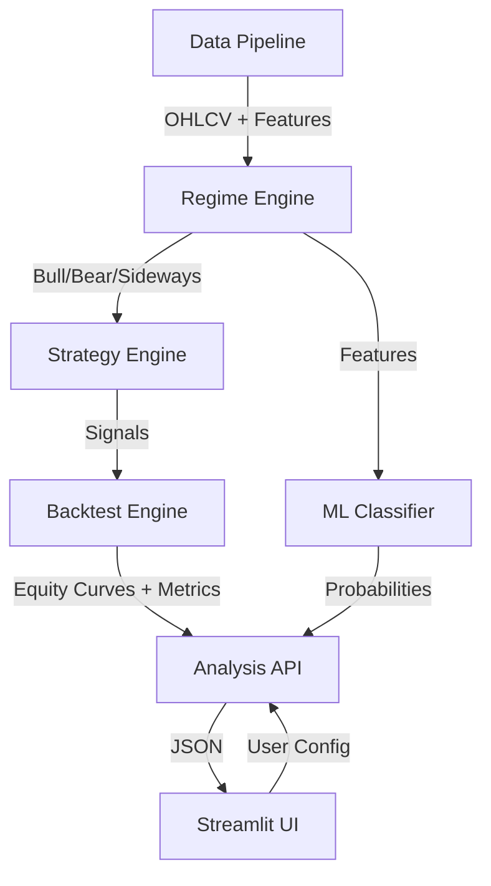

# Indian Market Portfolio Intelligence

## Final Project Positioning, Objective Clarification, and System Philosophy

---

# 1. What This Project Actually Is

**Indian Market Portfolio Intelligence** is not a generic stock prediction app.

It is a **regime-aware quantitative trading intelligence platform** designed for the Indian equity market, specifically focused on:

* Strategy evaluation
* Market regime identification
* ML-assisted strategy recommendation
* Probabilistic short-term forecasting
* Risk simulation
* Backtesting realism
* Quantitative decision support

The project combines:

* quantitative finance,
* machine learning,
* market microstructure concepts,
* strategy analytics,
* and risk engineering

into a single workflow targeted at Indian markets.

The core idea is:

> Instead of predicting exact stock prices, identify the current market regime and determine which trading strategy or directional outlook has the highest probability of succeeding under current market conditions.

That distinction is critical.

---

# 2. What The Project Is NOT

The project is NOT:

* a guaranteed profit machine,
* a magical stock predictor,
* a high-frequency trading system,
* a brokerage replacement,
* or an automated wealth management platform.

The system does NOT attempt deterministic prediction.

It does NOT claim:

* guaranteed profits,
* future certainty,
* or precise price forecasting.

Instead, it provides:

* probabilistic short-term market outlooks,
* regime-aware strategy recommendations,
* quantified risk understanding,
* and tactical trading intelligence.

The project should NEVER be positioned as:

> “AI predicts stock prices.”

The correct positioning is:

> “ML-assisted probabilistic market intelligence under varying market regimes.”

---

# 3. Core Objective

The actual objective of the project is:

> To build a regime-aware machine learning platform that evaluates Indian equity market conditions and provides probabilistic short-term trading insights, strategy recommendations, and risk-aware analytics for both beginner and professional traders.

The system aims to improve:

* decision quality,
* strategy selection,
* market awareness,
* and risk understanding.

It does NOT aim to eliminate uncertainty.

---

# 4. Is This For Traders or Investors?

## Primary Answer

This is fundamentally a **trader-oriented platform**, not a traditional investor platform.

---

## Why?

The architecture is built around:

* strategy rotation,
* regime adaptation,
* tactical positioning,
* signal generation,
* short/medium horizon evaluation,
* and dynamic market interpretation.

Those are trading-centric problems.

---

## Evidence From The System

### Regime Detection

Bull/Bear/Sideways classification is primarily useful for:

* tactical allocation,
* strategy switching,
* and timing.

Long-term investors rarely require rolling regime detection.

---

### Strategy Engine

Implemented strategies:

* RSI
* Momentum
* Bollinger Bands
* Moving Average Crossovers
* Dual Momentum

These are trading frameworks.

---

### Backtesting Layer

Includes:

* slippage,
* commissions,
* execution lag,
* and signal delays.

Those are essential for trading systems.

---

### ML Recommendation Layer

The classifier predicts:

> Which strategy has the highest probability of outperforming over the next 63 trading days.

That is a tactical trading problem.

---

# 5. Why “Portfolio Intelligence” Is Still Appropriate

The system still performs:

* risk analytics,
* allocation reasoning,
* strategy comparison,
* and portfolio-level evaluation.

However:

* it is not a passive investment advisory tool,
* and it is not a wealth management application.

A more technically accurate positioning is:

> “Regime-aware quantitative trading intelligence platform for Indian equity markets.”

---

# 6. Target Users

The platform serves two distinct user categories.

---

# 7. Beginner Dashboard

## Target User

Retail participants with little or no quantitative finance knowledge.

---

## Beginner Inputs

The beginner should ideally provide only:

* Stock/index
* Capital amount
* Optional risk tolerance

The beginner should NOT:

* choose strategies,
* tune indicators,
* optimize parameters,
* or compare Sharpe ratios.

That creates:

* decision overload,
* misuse,
* and pseudo-confidence.

---

## Beginner Outputs

The system automatically generates:

| Output          | Example                      |
| --------------- | ---------------------------- |
| Market Outlook  | Moderately Bullish           |
| Confidence      | 64%                          |
| Current Regime  | Bull Market                  |
| Suggested Style | Momentum-based               |
| Drawdown Risk   | Medium                       |
| Warning         | Elevated volatility expected |

The beginner dashboard abstracts quantitative complexity.

The system effectively becomes:

> “Decision abstraction through machine learning.”

---

# 8. Professional Dashboard

## Target User

* Advanced traders
* Quants
* Finance students
* Strategy researchers
* Quantitative analysts

---

## Features

The professional dashboard includes:

* Strategy comparison
* Equity curves
* Regime heatmaps
* Drawdown analysis
* Sharpe comparison
* ML probabilities
* Backtesting metrics
* Risk simulations
* Regime transitions

The professional dashboard is:

* analytical,
* strategy-oriented,
* and insight-driven.

This layer acts as the actual quant research environment.

---

# 9. System Architecture

---

# 10. Component Breakdown

## Data Pipeline (`src/data_pipeline.py`)

* Fetches OHLCV data using yfinance
* Engineers 20+ quantitative features
* Includes:

  * RSI
  * ADX
  * MACD
  * Volatility
  * Rolling returns
  * Trend indicators

---

## Regime Engine (`src/regime_detector.py`)

Uses:

* KMeans clustering
* rolling volatility,
* rolling returns,

to classify the market into:

* Bull
* Bear
* Sideways

---

## Strategy Engine (`src/strategies.py`)

Implemented strategies:

| Strategy        | Logic                        |
| --------------- | ---------------------------- |
| Buy & Hold      | Always Long                  |
| MA Crossover    | 50 SMA > 200 SMA             |
| RSI             | Oversold/Overbought logic    |
| Momentum        | Positive 12m returns         |
| Bollinger Bands | Mean-reversion logic         |
| Dual Momentum   | Relative + absolute momentum |

---

## Backtest Engine (`src/backtester.py`)

Implements:

* transaction costs,
* slippage,
* signal lag,
* realistic execution assumptions.

---

## ML Classifier (`src/classifier_training.py`)

Uses Random Forest classification.

Target:

* predict probability of strategy outperformance.

Features:

* lagged returns,
* volatility,
* regime state,
* momentum,
* trend indicators.

---

## Risk Forecaster (`src/risk_forecaster.py`)

Uses:

* regime-conditioned bootstrap resampling,
* probabilistic scenario simulation,
* future drawdown estimation.

Outputs:

* worst-case drawdown,
* median case,
* best-case scenarios.

---

# 11. Short-Term Forecasting Philosophy

A major refinement in project direction is:

The system should NOT predict exact future prices.

Instead:

> The system estimates probabilistic short-term market outlooks under current market conditions.

This is significantly more defensible.

---

# 12. What The Forecasting Layer Should Predict

The system should output:

| Metric                          | Example   |
| ------------------------------- | --------- |
| Probability of positive returns | 68%       |
| Expected volatility             | Moderate  |
| Expected regime continuation    | Bullish   |
| Confidence score                | Medium    |
| Risk-adjusted attractiveness    | Favorable |
| Drawdown risk                   | Elevated  |

This is superior to:

> “The stock will reach ₹X.”

---

# 13. Recommended Technical Wording

The strongest positioning statement is:

> “The system does not attempt deterministic price prediction. Instead, it estimates the probability of favorable short-term performance under current market conditions using regime-aware machine learning models.”

This wording demonstrates:

* realism,
* quantitative maturity,
* and understanding of financial ML limitations.

---

# 14. Why This Is Still A CORE ML Project

The project is NOT merely using historical data.

Machine learning is structurally central.

---

## ML Usage Areas

### A. Regime Classification

Uses:

* unsupervised learning,
* KMeans clustering.

---

### B. Strategy Recommendation

Uses:

* supervised learning,
* Random Forest classification.

---

### C. Short-Term Outlook Estimation

Uses:

* probabilistic ML outputs,
* confidence estimation,
* feature-driven directional inference.

---

### D. Risk Simulation

Uses:

* bootstrap probabilistic forecasting,
* scenario generation.

---

### E. Feature Engineering

The system engineers predictive features such as:

* volatility,
* lagged returns,
* RSI,
* MACD,
* trend indicators,
* regime states,
* rolling returns.

---

# 15. Why Deep Learning Was NOT Chosen

This is one of the most important technical decisions.

The decision to avoid:

* LSTM,
* CNN,
* Transformer,
* GRU,
* and deep reinforcement learning

is rational and defensible.

---

# 16. Financial Markets Are Highly Noisy

Financial time series suffer from:

* regime shifts,
* changing distributions,
* low signal-to-noise ratio,
* weak stationarity,
* and unstable generalization.

Several surveyed papers acknowledge these limitations.

Deep learning often performs well academically but struggles with robustness in live markets.

---

# 17. Price Prediction ≠ Tradable Alpha

Many deep learning papers optimize:

* MSE,
* RMSE,
* MAE,
* R².

But traders actually care about:

* Sharpe ratio,
* drawdown,
* consistency,
* execution realism,
* and robustness.

Good prediction accuracy does not guarantee profitable trading.

---

# 18. Deep Learning Requires Massive Data

LSTM and Transformer systems typically require:

* massive datasets,
* high-frequency data,
* institutional infrastructure,
* and large computational resources.

This project operates on:

* Indian equity daily data,
* interpretable strategy logic,
* limited historical samples,
* and regime-aware analytics.

Traditional ML is more suitable.

---

# 19. Interpretability Matters

Random Forest and regime-based systems provide:

* feature visibility,
* explainability,
* regime traceability,
* and transparent decision logic.

Deep neural networks are effectively black boxes.

For financial systems, interpretability is extremely important.

---

# 20. Backtest Overfitting Is A Serious Risk

Modern financial ML literature repeatedly warns about:

* backtest overfitting,
* false discoveries,
* unstable generalization,
* and unrealistic performance claims.

Complex deep learning systems are especially vulnerable.

The architecture intentionally prioritizes:

* robustness,
* explainability,
* and realistic evaluation.

---

# 21. Why KMeans + Random Forest Was A Strong Choice

## KMeans

Useful for:

* unsupervised regime discovery,
* volatility-return segmentation,
* interpretable clustering.

---

## Random Forest

Advantages:

* strong tabular-data performance,
* low overfitting risk,
* interpretability,
* nonlinear decision boundaries,
* small-data compatibility.

Financial tabular datasets are often better suited to:

* tree ensembles,
* boosting systems,
* and probabilistic models

than large deep learning architectures.

---

# 22. Comparison Against Existing Platforms

| Platform       | Strength             | Limitation                          |
| -------------- | -------------------- | ----------------------------------- |
| Zerodha Streak | Strategy execution   | Weak ML/regime intelligence         |
| TradingView    | Charting             | No adaptive strategy recommendation |
| QuantConnect   | Quant infrastructure | Too technical for retail            |
| MetaTrader     | Execution            | Weak intelligence layer             |
| Smallcase      | Portfolio themes     | No regime adaptation                |

---

# 23. Core Differentiator

The differentiator is NOT:

* charting,
* indicators,
* or backtesting alone.

The differentiator is:

> “ML-driven regime-aware strategy and outlook recommendation for Indian markets.”

That combination is relatively uncommon.

---

# 24. What Has Been Implemented

## Completed Components

### Data Pipeline

* OHLCV ingestion
* feature engineering
* indicator generation

---

### Regime Engine

* Bull/Bear/Sideways classification

---

### Strategy Engine

* 6 trading strategies

---

### Backtest Engine

* realistic execution assumptions

---

### ML Classifier

* Random Forest probability estimation

---

### Risk Forecaster

* bootstrap-based probabilistic simulation

---

### Dashboards

* Beginner abstraction layer
* Professional analytics layer

---

# 25. Realistic Expectations From The System

The system should improve:

* strategy selection,
* tactical decision-making,
* market awareness,
* and risk understanding.

The system is NOT expected to:

* guarantee profits,
* perfectly predict markets,
* or eliminate uncertainty.

The project aims for:

> “Probabilistic improvement in trading decisions under varying market conditions.”

---

# 26. Final Technical Positioning

The cleanest technical description of the project is:

> “Indian Market Portfolio Intelligence is a regime-aware quantitative trading intelligence platform for Indian equity markets that combines machine learning, strategy backtesting, probabilistic short-term forecasting, and risk simulation to generate context-sensitive trading insights under varying market conditions.”

---

# 27. Strengths Of The Project

## Major Strengths

* Clear quant architecture
* Practical applicability
* Realistic trading assumptions
* Proper ML integration
* Strong beginner/pro separation
* Explainable ML pipeline
* Better grounded than most stock prediction projects

---

# 28. Current Weaknesses

## Limitations

* Limited asset universe
* Daily timeframe only
* No live trading execution
* No portfolio optimization yet
* No adaptive online learning
* Simplistic KMeans regime logic
* Limited strategy library

---

# 29. Most Important Clarification

The project is NOT:

> “AI predicts future stock prices.”

The project IS:

> “Machine learning helps identify market conditions and estimate which trading strategies or directional outlooks are most favorable under current market regimes.”

That is the actual core objective.
