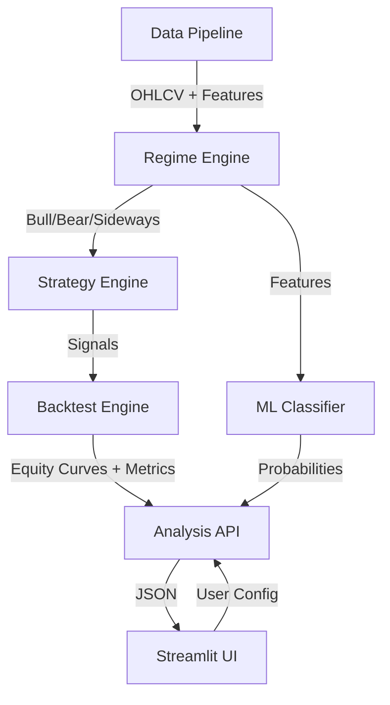

# Indian Market Portfolio Intelligence

## 1. Mission Statement
**Indian Market Portfolio Intelligence** is a specialized strategy evaluation and risk intelligence platform for the Indian equity market (NIFTY 50). It bridges the gap between raw market data and actionable quantitative insights by combining technical analysis with machine learning regime detection and historical simulation.

## 2. System Architecture



### Component Breakdown
1.  **Data Pipeline (`src/data_pipeline.py`)**: Fetches Nifty data from yfinance, engineers 20+ features (RSI, ADX, MACD, Volatility, Returns).
2.  **Regime Engine (`src/regime_detector.py`)**: Uses KMeans clustering on rolling volatility and returns to classify the market into **Bull**, **Bear**, or **Sideways** regimes.
3.  **Strategy Engine (`src/strategies.py`)**: Implements 6 quantitative strategies (Buy & Hold, MA Crossover, RSI, Momentum, Bollinger Bands, Dual Momentum).
4.  **Backtest Engine (`src/backtester.py`)**: Simulates trade execution with 1-day signal lag, transaction costs (commission), and slippage.
5.  **ML Classifier (`src/classifier_training.py` / `src/classifier_inference.py`)**: A Random Forest model trained on historical regime transitions to predict which strategy has the highest probability of outperforming the benchmark.
6.  **Risk Forecaster (`src/risk_forecaster.py`)**: Uses bootstrap resampling of regime-specific returns to simulate 1,000 potential future paths and estimate max drawdown risk.

## 3. Strategy Logic

| Strategy | Signal Logic |
| :--- | :--- |
| **Buy & Hold** | Always 1 (Long). The benchmark. |
| **MA Crossover** | 50-day SMA > 200-day SMA. |
| **RSI** | Long when RSI < 30 (oversold), Exit when RSI > 70. |
| **Momentum** | Long when 12-month returns > 0 (Absolute Momentum). |
| **Bollinger Bands** | Long when Price < Lower Band, Exit when Price > SMA(20). |
| **Dual Momentum** | Long when (12m Ret > 0) AND (12m Ret > Benchmark Ret). |

## 4. ML & Quant Internals

### Regime Detection
- **Features**: 21-day rolling volatility and 21-day cumulative returns.
- **Algorithm**: KMeans (k=3).
- **Mapping**: 
    - High Returns + Low Vol = **Bull**
    - Negative Returns + High Vol = **Bear**
    - Low Returns + Moderate Vol = **Sideways**

### ML Recommendation
- **Target**: `is_best` (Binary) — did this strategy beat Buy & Hold over the next 63 days?
- **Features**: Lagged returns, volatility, regime state, and trend indicators.
- **Confidence Threshold**: 55%. If no strategy has >55% probability, the system falls back to historical Sharpe leaders for the current regime.

### Risk Simulation
- **Method**: Block Bootstrap (resampling sequences of returns within the same regime).
- **Horizon**: 63 trading days (approx. 1 quarter).
- **Output**: 10th (Worst), 50th (Median), and 90th (Best) percentile max drawdowns.

## 5. API Specification

### `POST /analyze`
The primary endpoint for full pipeline execution.
- **Request Body**:
    ```json
    {
      "ticker": "^NSEI",
      "start_date": "2015-01-01",
      "end_date": "2024-05-10",
      "strategy": "all",
      "initial_investment": 100000,
      "commission_pct": 0.001,
      "slippage_pct": 0.001
    }
    ```
- **Response**: Comprehensive object containing `current_regime`, `recommended_strategy`, `equity_curves`, and `regime_heatmap`.

## 6. Development Guide

### Installation
```bash
# Uses uv for fast dependency management
uv sync
```

### Running the Dashboard
```bash
uv run streamlit run src/app.py
```

### Running Tests
```bash
uv run pytest tests/
```

## 7. Roadmap & Sprints
- [x] **Sprint A**: Core Platform (Data → Regimes → Backtest).
- [x] **Sprint B1**: Quant Realism (Commission, Slippage).
- [ ] **Sprint B2**: Portfolio Optimization (Markowitz Efficient Frontier).
- [ ] **Sprint C**: Multi-Asset Support (BankNifty, Midcap, Sectoral indices).
