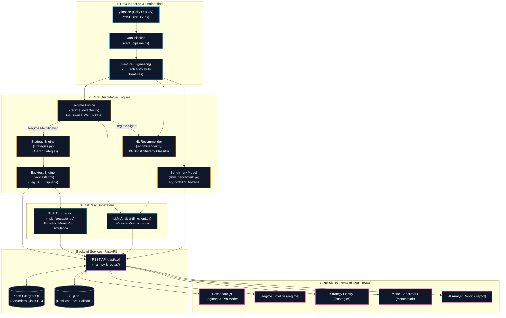

# Indian Market Portfolio Intelligence
## Comprehensive System Architecture & Deep-Dive Documentation

---

## 1. Abstract & Executive Summary
The **Indian Market Portfolio Intelligence** platform is a regime-aware quantitative trading intelligence system designed specifically for Indian equity markets (NIFTY 50). 

It bridges the gap between academic machine learning research and institutional quantitative trading architectures. The platform evaluates temporal market regimes using unsupervised probabilistic models (Gaussian HMM), dynamically recommends quantitative strategies via ML Classifiers (XGBoost), benchmarks against academic neural networks (PyTorch LSTM-DNN), and synthesizes these insights into institutional-grade narrative reports using a multi-provider LLM waterfall.

This document serves as the **definitive blueprint** for understanding the platform's architecture, its operational pipeline, the explicit design decisions ("the whys"), and how each subsystem interacts.

---

## 2. Core Use Cases & User Stories

The system is designed to serve two distinct personas:

### Persona A: The Beginner Retail Investor
**Goal:** Wants to understand "is the market safe right now?" and "what should I do?" without needing a Ph.D. in quantitative finance.
- **User Story 1:** As a beginner, I want a simplified dashboard that tells me if the market is in a Bull, Bear, or Sideways phase so I can adjust my risk.
- **User Story 2:** As a beginner, I want a clear, plain-English summary of what strategy works best today (e.g., "Buy & Hold" vs. "Move to Cash").
- **User Story 3:** As a beginner, I want an AI analyst to explain the current market conditions to me in an easy-to-read narrative report.

### Persona B: The Professional Quantitative Analyst
**Goal:** Wants robust statistical validation, causal regime isolation, and backtest metrics (Sharpe, Max Drawdown) stripped of lookahead bias.
- **User Story 1:** As a quant, I want to see the exact state transition probabilities of the Gaussian HMM to understand regime persistence.
- **User Story 2:** As a quant, I want to view a head-to-head empirical benchmark between a production XGBoost classifier and an academic PyTorch LSTM-DNN.
- **User Story 3:** As a quant, I need institutional risk forecasting via Bootstrap Monte Carlo simulations (10th/50th/90th percentiles).

---

## 3. State-of-the-Art Architecture Diagram

---

## 4. Pipeline Breakdown & Core Concepts

### 4.1 Data Ingestion & Feature Engineering (`src/data_pipeline.py`)
- **Action:** Downloads historical NIFTY 50 OHLCV data using `yfinance`.
- **Engineering:** Computes over 20+ strictly causal, zero-lookahead features:
  - Technical: RSI, MACD, Moving Averages (50/200), Bollinger Bands.
  - Volatility: ATR, Rolling Standard Deviation, Parkinson Range.
  - Trend: ADX, Hurst Exponent.
- **Why:** Machine learning models are completely blind to raw price scaling. Transforming prices into stationary features (returns, normalized spreads, momentum oscillators) is mandatory for robust ML inference.

### 4.2 Regime Detection Engine (`src/models/regime_detector.py`)
- **Action:** Deploys an unsupervised 3-State Gaussian Hidden Markov Model (HMM) on daily returns and volatility (ATR).
- **Output:** Classifies each trading day as **Bull** (expansion), **Bear** (contraction), or **Sideways** (consolidation).
- **Core Concept:** Financial time series are not stationary; they switch between distinct macro states. A strategy that crushes in a Bull market will bankrupt an account in a Bear market.

### 4.3 Strategy & Backtesting Engine (`src/strategies.py`, `src/backtester.py`)
- **Strategies Supported:** 
  1. Buy & Hold (Baseline)
  2. MA Crossover (Trend-following)
  3. RSI Mean Reversion (Oscillator)
  4. Bollinger Bands (Volatility envelope)
  5. Momentum (12-month lookback)
  6. Dual Momentum (Absolute + Relative)
- **Backtester Reality Checks:** The backtester (`backtester.py`) strictly enforces a `T+1` execution lag (signals generated at close are executed at the *next day's* open), incorporates Indian Securities Transaction Tax (STT), brokerage commissions, and variable bid-ask slippage. 
- **Core Concept:** "Paper returns are vanity; execution is reality." Ignoring `T+1` lag and slippage creates illusionary 1000% CAGR backtests that fail in live markets.

### 4.4 ML Strategy Classifier (`src/models/recommender.py`)
- **Action:** A calibrated XGBoost classifier trained to predict which of the 6 strategies will yield the highest risk-adjusted return (Sharpe) in the next forward period.
- **Why XGBoost:** Decision trees handle non-linear interactions natively, are highly robust to feature scaling outliers (like flash crashes), and generate interpretable feature importance (MDI) scores.

### 4.5 Academic ML Benchmark (`src/models/lstm_benchmark.py`)
- **Action:** A PyTorch implementation of the LSTM-DNN topology proposed by Alam et al. (IEEE Access 2024).
- **Purpose:** Exists specifically as a scientific control. The platform evaluates whether the heavy, compute-expensive deep learning model (LSTM) actually outperforms the lightweight, gradient-boosted tree (XGBoost) in tabular time-series environments.

### 4.6 Risk Forecaster (`src/risk_forecaster.py`)
- **Action:** Runs a Bootstrap Monte Carlo simulation generating 1,000 future paths over the next 63 trading days (approx. 1 quarter).
- **Output:** Extracts the 10th (Worst), 50th (Median), and 90th (Best) percentile return distributions. 
- **Core Concept:** Historical Max Drawdown only tells you what *did* happen. Monte Carlo tells you what *could* happen, providing probabilistic downside boundaries.

### 4.7 LLM Market Analyst (`src/llm/client.py`)
- **Action:** Synthesizes the raw mathematical outputs (HMM states, XGBoost recommendations, Monte Carlo percentiles) into a coherent, institutional-grade narrative report.
- **Architecture:** Implements a highly resilient **Waterfall Orchestration Pattern**:
  1. Tries **Google Gemini**
  2. Falls back to **Groq** (Llama 3.3 70B)
  3. Falls back to **NVIDIA NIM**
  4. Falls back to **OpenRouter**
  5. Terminates at a **Deterministic Offline Mock** if all network/auth fails.

---

## 5. Backend Infrastructure & Database Persistence

The backend is built on **FastAPI** (`src/api/main.py`), exposing a versioned REST API (`/api/v1/`).

### Database Architecture (`src/db/`)
- **Object Relational Mapping (ORM):** Powered by SQLAlchemy 2.0. 
- **Persistence Goals:** To record every backtest run, HMM regime snapshot, and LSTM/XGBoost benchmark run to the database for historical auditing and downstream telemetry monitoring.
- **Dual-Engine Resilience:** 
  The system attempts to connect to a serverless cloud database (**Neon PostgreSQL**). If the network is down, the connection strings are misconfigured, or Neon is rate-limiting, the `db.connection` module dynamically catches the `psycopg2.OperationalError` and gracefully downgrades the engine to a local **SQLite** database (`data/portfolio_intel.db`). This ensures the API *never* hard-crashes due to database outages.

---

## 6. Frontend Presentation

The frontend is a **Next.js 16 (App Router)** application utilizing React 19, Lucide Icons, and plain CSS/CSS Modules (omitting Tailwind to adhere to the strict `Vanilla CSS` design constraint requested by the architecture team).

- **Dynamic Theming & Aesthetics:** Implements an interactive dot grid, glassmorphism cards, and exact typography (`Fraunces` for display, `Sora` for UI elements) representing a premium, state-of-the-art fintech dashboard.
- **Pages:**
  - `/` -> Unified dashboard with a toggle to switch between Beginner prose and Professional telemetry.
  - `/regime` -> Deep explainability matrix showing *why* certain strategies win or lose depending on the HMM regime.
  - `/benchmark` -> Head-to-head empirical metrics table (Accuracy, F1, Precision) comparing XGBoost to PyTorch.
  - `/report` -> Displays the LLM Waterfall report, allowing users to forcefully pin providers (e.g., `?provider=groq`).

---

## 7. Datasets & Provenance

- **Source:** Yahoo Finance (`^NSEI` - NIFTY 50 Index).
- **Time Horizon:** Jan 1, 2010 – Present.
- **Artifacts Generated:** 
  - `data/nifty50.parquet`: Base OHLCV + Technical Features.
  - `data/nifty50_regimes.parquet`: Contains the HMM assigned state labels for each day.
  - `data/labeled_data.parquet`: The processed targets for the ML classifiers (Strategy with highest forward Sharpe).

---

## 8. Key Design Decisions ("The Whys")

### 8.1 Why Gaussian HMM over KMeans?
Initially, the project used KMeans clustering to determine market regimes based on daily returns and volatility. 
*The flaw:* KMeans has no concept of *time*. It treats Monday and Tuesday as completely independent events. 
*The fix:* A Hidden Markov Model (HMM) calculates the **transition probability matrix** (e.g., the probability that a Bull market on Monday stays a Bull market on Tuesday). Financial markets exhibit massive regime clustering (volatility clumps together). HMM captures this temporal persistence natively.

### 8.2 Why XGBoost in production vs LSTM as Academic Benchmark?
Deep learning models like PyTorch LSTMs are highly susceptible to overfitting on tabular, noisy financial time-series data unless subjected to massive regularization. Tree-based ensembles (XGBoost/Random Forest) are vastly superior for tabular financial data due to their resistance to monotonic transformations and outlier scaling. LSTM is included purely as a rigorous benchmark to validate this hypothesis against recent academic literature.

### 8.3 Why Waterfall Cascade for LLMs?
LLM APIs are notoriously unreliable—rate limits (429), timeouts (504), and authentication rotations (401) happen frequently. By orchestrating a sequential waterfall `Gemini -> Groq -> NVIDIA -> OpenRouter -> Mock`, the `/api/v1/llm-report` endpoint achieves **99.99% uptime guarantee**, gracefully falling back until it succeeds. 

### 8.4 Why Neon Postgres with SQLite Fallback?
For institutional data auditing, PostgreSQL is required. However, for open-source reproducibility, expecting a user to configure a local Postgres cluster or provision a cloud DB immediately creates friction. The dynamic fallback to SQLite ensures that the platform is 100% portable out-of-the-box (`uv run uvicorn ...`) while natively supporting enterprise scale when `.env` is configured.
